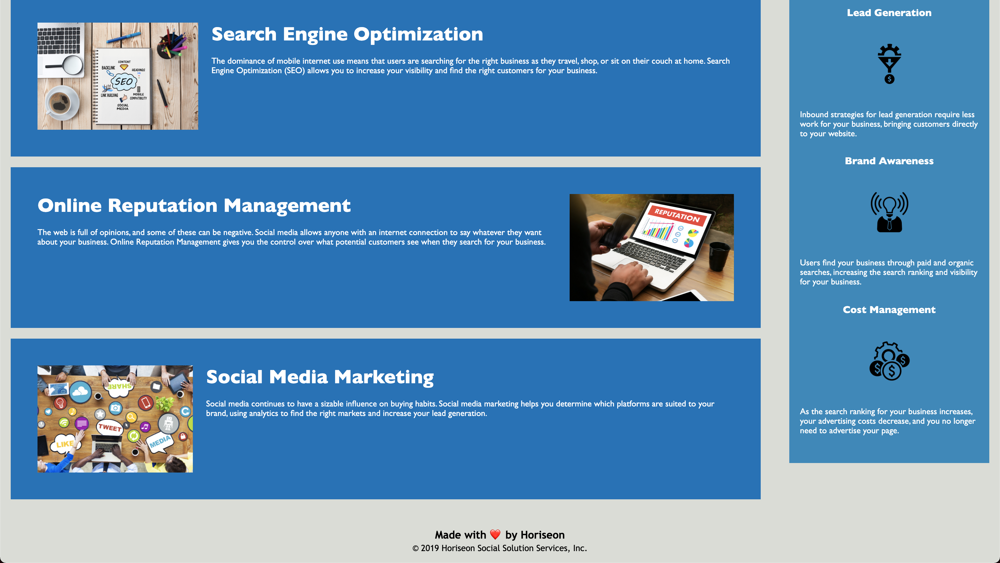

# Week 1 Homework

## Description
This is my week one homework. The HTML and CSS code were provided, however, it was a bit messy, as there was repetitive code.
I went in and cleaned up the code and added comments in the html and css to make it more organized.

There was also a broken link that I fixed. (Clicking on Search Engine Optimization went nowhere)

## What did I learn

This was a good exercise on combining classes in CSS, as well as using the header/body/footer that are already basic HTML.
This is also my first README file! I hope I did a good job.

## How the website should look
***

